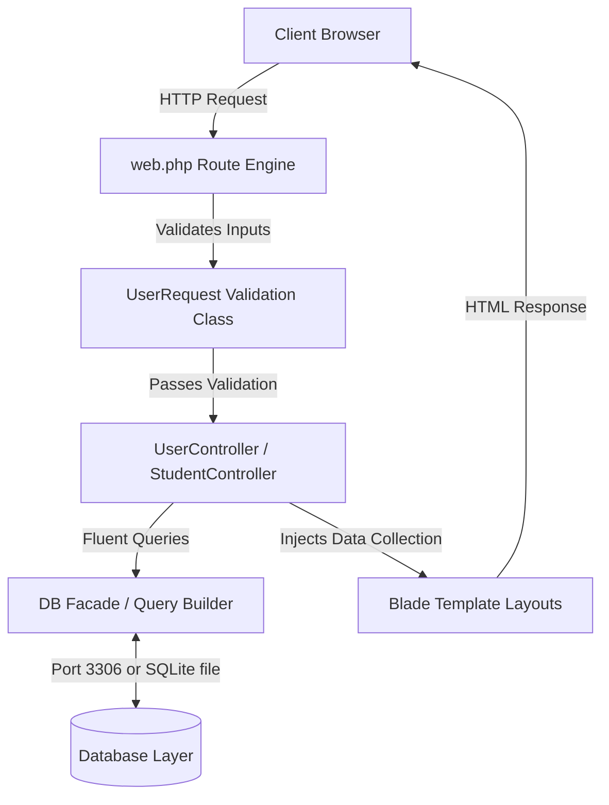

# Laravel Fluent Query & CRUD Demo

A comprehensive, production-ready showcase of advanced database operations in **Laravel 12** and **PHP 8.2+** utilizing Laravel's Fluent Query Builder (`DB` facade) rather than standard Eloquent ORM. This application implements structured CRUD processes, custom form request validations, relational joins, automated JSON-driven seeding, and dynamic paginated layouts inside Blade templates.

---

## 🛠️ Technology Stack & Dependencies


---

## 🚀 Key Features

*   **Fluent Query Builder Engine**: Operates CRUD operations directly via the `DB::table` facade, illustrating high-performance database manipulation without ORM overhead.
*   **Encapsulated Request Validation**: Utilizes a customized `UserRequest` class to enforce strict user inputs (e.g., minimum age of 18, numeric limits, standard emails) before database insertion.
*   **Relational Joins & Selection**: Demonstrates advanced database joins (`students` table joined to the `cities` table on `city_id`), specific column extraction, sorting (`orderBy`), and pagination.
*   **Dynamic Client-Side Pagination**: Implements optimized database-level records splitting (`paginate(4)` and `paginate(5)` views), serving navigation links automatically without client load lags.
*   **Automated JSON Seeding**: Implements custom seeders (`userSeeder`) that read raw data from JSON resources (`database/json/users.json`) to seed relational database tables.
*   **Cascading Schema Migrations**: Employs structured schemas including a cascade-on-delete relationship between students and cities using standard foreign-key declarations.
*   **Blade Layout Interface**: Implements clear, reusable template components for user roster views, profiling, addition, and update dashboards.

---

## 📐 Application Architecture & Data Flow

The data flow within the application follows a modern Model-View-Controller pattern, leveraging custom requests for validation and the Fluent Query Builder for database interaction:



---

## 📂 Repository File Directory

```
Laravel-Query/
├── app/
│   ├── Http/
│   │   ├── Controllers/
│   │   │   ├── Controller.php        # Core base controller
│   │   │   ├── StudentController.php # Joins students & cities with pagination
│   │   │   └── UserController.php    # Custom user CRUD using DB facade
│   │   └── Requests/
│   │       └── UserRequest.php       # Enforces form rules, attributes & limits
│   └── Models/
│       ├── student.php               # Student model definition
│       └── User.php                  # User model definition
├── config/                           # Standard application configuration scripts
├── database/
│   ├── json/
│   │   └── users.json                # Raw data source for database seeding
│   ├── migrations/                   # Schema migrations (users, cities, students, sessions)
│   └── seeders/                      # Seed scripts (userSeeder, StudentSeeder, CitySeeder)
├── resources/
│   ├── views/                        # Blade visual presentation layouts
│   │   ├── addUser.blade.php         # Renders the addition form with validation errors
│   │   ├── allUsers.blade.php        # Paginated users grid with delete/update routing
│   │   ├── studentList.blade.php     # Joined list outputting student and city metadata
│   │   ├── updateUser.blade.php      # Renders individual records modify dashboard
│   │   └── user.blade.php            # Outputs single profile details
│   └── css/                          # Application CSS resources
├── routes/
│   ├── web.php                       # Primary routing maps (routes group controllers)
│   └── console.php                   # Command-line configuration settings
├── composer.json                     # PHP package configurations
└── vite.config.js                    # Bundler configuration file
```

---

## 📝 Key Source Code Showcases

### 1. Relational Joins & Pagination ([StudentController.php](file:///d:/for%20CV/My%20learnings/Laravel-Query/app/Http/Controllers/StudentController.php))
Renders dynamic database joining, attribute selecting, and pagination limiting to 5 records per page:
```php
namespace App\Http\Controllers;

use Illuminate\Support\Facades\DB;

class StudentController extends Controller
{
    public function showStudents(){
        $students = DB::table('students')
                ->join('cities' , 'students.city_id' , '=' , 'cities.id')
                ->select('students.id' ,'students.name' ,'students.email' , 'cities.city_name')
                ->orderBy('students.id' , 'asc')
                ->paginate(5);

        return view('studentList' , ['data' => $students]);
    }
}
```

### 2. Encapsulated Input Validation ([UserRequest.php](file:///d:/for%20CV/My%20learnings/Laravel-Query/app/Http/Requests/UserRequest.php))
Secures the database by defining strict rules, renaming parameter labels for user-friendly error views, and enforcing a stop-on-first-failure flag:
```php
namespace App\Http\Requests;

use Illuminate\Foundation\Http\FormRequest;

class UserRequest extends FormRequest
{
    public function authorize(): bool
    {
        return true;
    }

    public function rules(): array
    {
        return [
            'username' => 'required',
            'userage' =>  'required|numeric|min:18',
            'useremail' => 'required|email',
            'usercity' =>  'required'
        ];
    }

    public function attributes()
    {
        return [
            'username' => 'User Name',
            'userage' =>  'User Age',
            'useremail' => 'User Email',
            'usercity' =>  'User City'
        ];
    }

    protected $stopOnFirstFailure = true;
}
```

### 3. Fluent CRUD Actions ([UserController.php](file:///d:/for%20CV/My%20learnings/Laravel-Query/app/Http/Controllers/UserController.php))
Performs secure row queries, updates, and deletes directly via query parameters:
```php
namespace App\Http\Controllers;

use Illuminate\Http\Request;
use App\Http\Requests\UserRequest;
use Illuminate\Support\Facades\DB;

class UserController extends Controller
{
    public function showUsers(){
        $users = DB::table('users')->paginate(4);
        return view('allUsers' , ['data' => $users]);
    }

    public function insertUser(UserRequest $req){
        $inserted = DB::table('users')->insert([
            'name' => $req->username,
            'age' =>  $req->userage,
            'email' =>  $req->useremail,
            'city' =>  $req->usercity
        ]);

        if($inserted){
            return redirect()->route('home');
        }
    }

    public function updateUser(Request $req, $id){
        $updated = DB::table('users')
                    ->where('id', '=', $id)
                    ->update([
                        'name' => $req->username,
                        'age' =>  $req->userage,
                        'email' => $req->useremail,
                        'city' =>  $req->usercity
                    ]);

        if($updated){
            return redirect()->route('home');
        }
    }

    public function deleteUser(string $id){
        $deleted = DB::table('users')->where('id', '=', $id)->delete();
        if($deleted){
            return redirect()->route('home');
        }
    }
}
```

---

## 💾 Database Schema Migration Structure

The system uses three primary tables configured through migration files:

### 1. `cities` Table
Acts as a reference master ledger for regional city locations:
*   `id` (Primary Key)
*   `city_name` (String, 30 chars)

### 2. `students` Table
Stores student profiles with cascading foreign key referencing:
*   `id` (Primary Key)
*   `name` (String, 30 chars)
*   `email` (String, 20 chars, nullable, unique)
*   `city_id` (Foreign Key -> references `cities.id`, deletes and updates cascade)

### 3. `users` Table
Handles standard user logs:
*   `id` (Primary Key)
*   `name` (String, 30 chars)
*   `age` (Integer)
*   `email` (String, 20 chars, nullable, unique)
*   `city` (String, 15 chars)

---

## 🚀 Setup & Execution Guide

### Prerequisites
Make sure the following are installed on your system:
*   **PHP** version 8.2 or higher
*   **Composer** (PHP dependency manager)
*   **Node.js** (for asset compilation via Vite)
*   An active database server (**MySQL / MariaDB**) or **SQLite** (configured inside your `.env` file).

### Installation & Run Steps
1.  **Clone the Repository**:
    ```bash
    git clone https://github.com/Imtiaz-Ali17314/Laravel-Query.git
    cd Laravel-Query
    ```
2.  **Install Composer Dependencies**:
    ```bash
    composer install
    ```
3.  **Install Node Modules**:
    ```bash
    npm install
    ```
4.  **Create Environment Configuration**:
    Copy the example file to `.env`:
    ```bash
    cp .env.example .env
    ```
5.  **Generate Secure Application Key**:
    ```php
    php artisan key:generate
    ```
6.  **Configure Database**:
    Open the `.env` file and set up your preferred database connections (e.g., MySQL or SQLite). For a lightweight SQLite setup:
    ```env
    DB_CONNECTION=sqlite
    # DB_DATABASE=database/database.sqlite (will be auto-created by Artisan if not present)
    ```
7.  **Run Database Migrations and JSON Seeds**:
    Run migrations and trigger seeders to import cities, students, and users:
    ```bash
    php artisan migrate --seed
    ```
8.  **Run Asset Compilation**:
    Launch Vite bundler:
    ```bash
    npm run dev
    ```
9.  **Start Development Server**:
    Run Laravel's internal server:
    ```bash
    php artisan serve
    ```
    Access the local application in your browser at `http://127.0.0.1:8000`.
